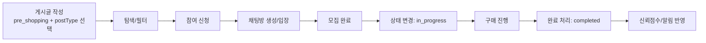
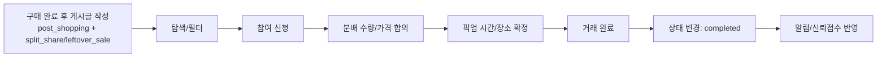

# 서비스 개요 · 유저 플로우 · 핵심 기능 정의서 (v1)

## 1) 문서 목적

이 문서는 현재 백엔드 구현 상태를 기준으로 서비스 핵심 기능을 정리하고,  
`쇼핑 전`/`쇼핑 후` 관점으로 카테고리를 재설계하기 위한 기획 기준안을 제공합니다.

- 작성일: 2026-04-09
- 범위: 서비스 개요, 유저 플로우, 핵심 기능 정의, 카테고리 세분화 초안
- 기준 코드: `src/models`, `src/services`, `src/routes` (Post/Participant/Favorite/Chat/Notification/User)

---

## 2) 현재 서비스(AS-IS) 요약

### 2.1 현재 제공 가치

- 캠퍼스 기반 공동구매 모집/참여를 빠르게 연결
- 참여자 관리, 관심 등록, 알림, 채팅, 신뢰점수까지 한 흐름에서 지원

### 2.2 현재 구현 기능 (코드 기준)

1. 게시글 생성/수정/삭제/조회
- 상태: `open`, `closed`, `in_progress`, `completed`, `cancelled`
- 인원/수량: `minParticipants`, `currentQuantity`
- 카테고리: 단일 필드 `category` (food/daily/beauty/electronics/school/freemarket)

2. 공동구매 참여/참여취소
- 중복 참여 방지, 작성자 참여 제한, 모집 상태 검증
- 참여 시 `currentQuantity` 갱신

3. 관심(즐겨찾기)
- 게시글 관심 등록/해제
- 게시글별 관심 수 및 사용자별 관심 목록 조회

4. 알림
- 새 참여자, 참여 취소, 공동구매 완료/취소 알림
- 읽음/전체읽음/미읽음 수 조회

5. 채팅
- 게시글 단위 채팅방
- 메시지 송수신/읽음 처리/미읽음 집계

6. 신뢰점수
- 활동 기반 점수 증감(+10, +5, -5, -3 등)
- 0~100 범위 관리

### 2.3 현재 한계

- 카테고리가 품목 중심 단일 필드라 `쇼핑 시점(전/후)`과 `거래 의도(구매/판매)`를 구분하기 어려움
- "쇼핑메이트 구함", "구매 후 계란 N빵" 같은 시나리오가 같은 범주로 섞임
- 필터/검색/추천 정확도가 떨어짐

---

## 3) 목표 서비스(TO-BE) 개요

### 3.1 서비스 정의

공동구매 중심 서비스를 확장해,  
`쇼핑 전(같이 사기/같이 가기)`과 `쇼핑 후(나누기/양도하기)`를 모두 다루는 캠퍼스 생활 쇼핑 네트워크로 발전시킨다.

### 3.2 카테고리 구조 (대분류 → 중분류 → 소분류)

`기존 단일 category`를 아래처럼 다차원으로 분리 제안:

1. 쇼핑 시점 (`shoppingStage`)
- `pre_shopping`: 구매 전 모집/계획 단계
- `post_shopping`: 구매 후 분배/재판매 단계

2. 거래 축 (`tradeIntent`)
- `purchase`: 구매 목적
- `sale`: 판매/양도 목적

3. 모집 유형 (`postType`) 예시
- 쇼핑 전/구매: `group_buy`, `shopping_mate`, `proxy_buy_request`
- 쇼핑 후/판매: `split_share`, `leftover_sale`, `sealed_transfer`

4. 품목 카테고리 (`itemCategory`) 예시
- `food`, `daily`, `beauty`, `electronics`, `school`, `etc`

### 3.3 사용자 요청 예시 매핑

- "쇼핑 전에 쇼핑메이트 구함"  
  - `shoppingStage=pre_shopping`, `tradeIntent=purchase`, `postType=shopping_mate`

- "쇼핑 이후 계란 N빵할 사람 구함"  
  - `shoppingStage=post_shopping`, `tradeIntent=sale`, `postType=split_share`, `itemCategory=food`

---

## 4) 유저 플로우

### 4.1 쇼핑 전 플로우 (공동구매/쇼핑메이트)

### 4.2 쇼핑 후 플로우 (N빵/재분배/양도)

---

## 5) 핵심 기능 정의서

| ID | 기능명 | 설명 | 핵심 정책 |
|---|---|---|---|
| CF-01 | 게시글 유형 분류 | 작성 시 쇼핑 시점/거래의도/모집유형/품목 선택 | 필수 enum 기반 입력 |
| CF-02 | 모집글 생성/수정/삭제 | 공동구매/쇼핑메이트/N빵 게시글 등록 | 작성자 권한, 상태별 수정 제한 |
| CF-03 | 참여/취소 | 모집글에 참여 및 취소 | 중복 참여 불가, 작성자 자기참여 불가 |
| CF-04 | 상태 전이 | 모집부터 완료/취소까지 단계 관리 | `open→closed→in_progress→completed`, 취소 분기 |
| CF-05 | 대화/협의 | 게시글 단위 채팅 | 참여자 중심 접근, 미읽음 집계 |
| CF-06 | 관심/재방문 | 관심 등록 및 관심 목록 | 중복 관심 불가, 마감 알림 연계 |
| CF-07 | 이벤트 알림 | 참여/취소/완료/취소 알림 발송 | 사용자별 읽음/미읽음 처리 |
| CF-08 | 신뢰점수 | 거래 행동 기반 점수화 | 0~100 범위, 완료/취소/이탈 반영 |
| CF-09 | 탐색/필터 | 카테고리 기반 목록 필터 | 시점 + 의도 + 모집유형 + 품목 복합 필터 |
| CF-10 | 거래 후 분배 시나리오 | 구매 완료 물품의 N빵/양도 | 수량/분배 단위 입력 지원(확장) |

---

## 6) 데이터/API 확장 제안 (기획 단계)

### 6.1 Post 확장 필드 제안

- `shoppingStage: 'pre_shopping' | 'post_shopping'`
- `tradeIntent: 'purchase' | 'sale'`
- `postType: string enum` (group_buy, shopping_mate, split_share ...)
- `itemCategory: string enum` (food, daily ...)
- (선택) `shareUnit`, `remainingQuantity` (N빵/분배 고도화 시)

### 6.2 조회 API 필터 제안

`GET /api/posts?shoppingStage=post_shopping&tradeIntent=sale&postType=split_share&itemCategory=food`

---

## 7) 우선순위 로드맵 (MVP → 고도화)

1. 1단계(MVP)
- 카테고리 체계 도입: `shoppingStage`, `tradeIntent`, `postType`
- 기존 `category`는 `itemCategory`로 점진 전환
- 목록 필터와 Swagger 스키마 반영

2. 2단계
- 쇼핑 후 시나리오 고도화: N빵 단위/남은 수량/마감 정책
- 알림 템플릿 세분화 (예: 분배 확정, 픽업 임박)

3. 3단계
- 신뢰점수 계산식 개선(쇼핑 전/후 활동 가중치 분리)
- 추천/랭킹(사용자 행동 기반)

---

## 8) 기획 결정이 필요한 항목

1. `postType` 최종 enum 확정
2. 판매(`sale`) 범위: 재판매만 허용 vs 교환/무료나눔 포함
3. 쇼핑 후 거래의 정산 기준: 총액/개당가/분배단위
4. 상태 전이 규칙의 쇼핑 전/후 차등 적용 여부

---

## 9) 요약

- 현재 백엔드는 공동구매 운영 핵심(게시글/참여/알림/채팅/신뢰점수)을 이미 갖춘 상태입니다.
- 다음 확장 핵심은 카테고리를 `품목 단일`에서 `시점 + 거래의도 + 모집유형 + 품목` 구조로 바꾸는 것입니다.
- 이 구조를 적용하면 "쇼핑메이트(쇼핑 전)"와 "계란 N빵(쇼핑 후)"을 명확히 분리해 사용자 탐색성과 운영 정책을 동시에 개선할 수 있습니다.
